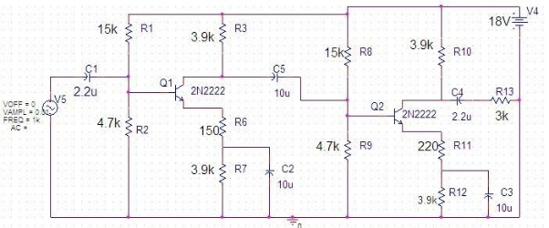
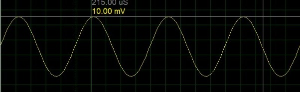
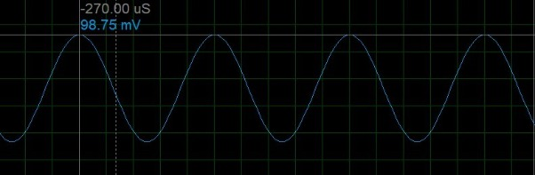
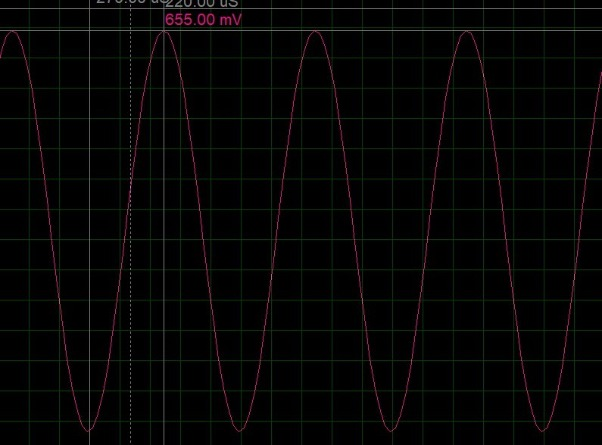

<div align="center">

# 📻 RC Coupled Cascaded Amplifier


A two-stage RC coupled cascaded BJT amplifier, built and simulated in **Proteus** to measure voltage gain and observe frequency response.

</div>

---

## 📌 About

This is **Lab 07** from the **Electronic Devices and Circuits (EDC) Lab** at the **Department of Computer Engineering, Bahria University Islamabad**. The experiment studies a two-stage RC coupled amplifier using 2N2222 transistors, measuring the voltage gain of each stage individually and the overall cascaded gain, and comparing measured values against theoretical expectations.

**Author:** Muhammad Shoaib

---

## ✨ Features

| Module | Functionality |
|---|---|
| 🔁 **Two-Stage Cascade** | Two common-emitter BJT stages (Q1, Q2) coupled through capacitors |
| 🎚️ **Voltage Divider Bias** | R1/R2 and R8/R9 networks set a stable Q-point for each transistor |
| ⚡ **RC Coupling** | Coupling capacitors pass AC signal between stages while blocking DC |
| 🔋 **Emitter Bypass** | Bypass capacitors provide a low-reactance AC path to boost stage gain |
| 📊 **Gain Measurement** | Individual and overall voltage gain measured and compared to theory |
| 📈 **Frequency Response** | Gain behavior observed across the input frequency range |

---

## 🖼️ Circuit Diagram

<p align="center">
  
</p>

<p align="center"><em>Two-stage RC coupled cascaded amplifier: Q1 and Q2 (2N2222), coupled through C3/C5, with voltage divider bias networks and emitter bypass capacitors.</em></p>

---

## 📈 Simulation Waveforms

<p align="center">
  
</p>
<p align="center"><em>Waveform 1: Input signal from the function generator.</em></p>

<br/>

<p align="center">
  
</p>
<p align="center"><em>Waveform 2: Output of the first amplifier stage.</em></p>

<br/>

<p align="center">
  
</p>
<p align="center"><em>Waveform 3: Output of the second amplifier stage, showing the overall cascaded gain.</em></p>

---

## 🧠 How It Works

1. **Signal Input** – An AC signal from the function generator (V1) is applied to the base of Q1 through coupling capacitor C1.
2. **First Stage Amplification** – Q1, biased by R1/R2/R4, amplifies the signal at its collector resistor R3.
3. **Inter-Stage Coupling** – Capacitor C3 couples the amplified AC signal from Q1's collector to Q2's base, blocking any DC offset from affecting the second stage's bias.
4. **Second Stage Amplification** – Q2, biased by R8/R9/R12, further amplifies the signal, with the final output taken across R11 through C4.
5. **Emitter Bypass** – Capacitors C2 and C5 bypass the emitter resistors of each stage, increasing the effective AC gain of each transistor.
6. **Overall Gain** – The total voltage gain is the product of the individual stage gains, slightly reduced in practice due to the loading effect of the second stage on the first.

---

## 🧰 Components Used

<div align="center">

### 🔵 Active Components

| # | Component | Qty |
|:---:|---|:---:|
| 1 | Transistor (2N2222) | 2 |

### 🟠 Resistors

| # | Value | Qty |
|:---:|:---:|:---:|
| 1 | 15 kΩ | 2 |
| 2 | 4.7 kΩ | 2 |
| 3 | 3.9 kΩ | 4 |
| 4 | 150 Ω | 1 |
| 5 | 220 Ω | 1 |
| 6 | 3 kΩ | 1 |

### 🟡 Capacitors

| # | Value | Qty |
|:---:|:---:|:---:|
| 1 | 2.2 µF (coupling) | 2 |
| 2 | 10 µF (bypass/coupling) | 3 |

### ⚙️ Supply & Source

| # | Component | Spec |
|:---:|---|---|
| 1 | DC Supply | 18 V |
| 2 | Signal Source | Sine wave, function generator (VSINE) |

</div>

---

## 📊 Measurements

| Parameter | Measured Value | Expected Value | % Error |
|---|:---:|:---:|:---:|
| **Stage 1** V<sub>B</sub> | 4.28 V | 4.20 V | 1.91% |
| **Stage 1** V<sub>C</sub> | 3.49 V | 3.55 V | 1.69% |
| **Stage 1** V<sub>E</sub> | 3.63 V | 3.58 V | 1.40% |
| **Stage 1** Gain | -0.813 | -0.820 | -0.85% |
| **Stage 2** V<sub>B</sub> | 4.27 V | 4.22 V | 1.81% |
| **Stage 2** V<sub>C</sub> | 3.31 V | 3.38 V | 2.70% |
| **Stage 2** V<sub>E</sub> | 3.62 V | 3.57 V | 1.40% |
| **Stage 2** Gain | -0.813 | -0.820 | -0.85% |
| **Overall Gain** | 0.661 | 0.670 | 1.34% |

All measured values stayed within roughly 3% of their theoretical expectations, confirming correct biasing and stable transistor operation across both stages.

---

## 🛠️ Tech Stack


- **Simulation Tool:** Proteus Design Suite
- **Concepts:** BJT Biasing (Voltage Divider) · RC Coupling · Emitter Bypass · Cascaded Amplifier Gain · Frequency Response Analysis

---

## 📁 Project Structure

```
EDC-Lab-07-RC-Coupled-Amplifier/
├── 📄 README.md
├── 📄 RC_Coupled_Amplifier.pdsprj         # Proteus project file
├── 📁 docs/
│   └── 📄 Lab_Report.pdf                  # Full lab report: theory, procedure, measurements, discussion
└── 📁 images/
    ├── 🖼️ Circuit_Schematic.png           # Circuit diagram
    ├── 🖼️ Waveform_1_Input.png            # Input waveform
    ├── 🖼️ Waveform_2_Stage1_Output.png    # First stage output
    └── 🖼️ Waveform_3_Stage2_Output.png    # Second stage output
```

---

## 🚀 Run Locally

**1. Clone the repository**
```bash
git clone https://github.com/muhammadshoaib-ce/EDC-Lab-07-RC-Coupled-Amplifier.git
```

**2. Open in Proteus**
```
File → Open Project → RC_Coupled_Amplifier.pdsprj
```

**3. Run the simulation**
```
Click the "Play" button at the bottom-left of the Proteus window
```

**4. Observe the results**
- Check the input waveform from the function generator
- Probe the collector of Q1 to see the first stage output
- Probe the output after C4 to see the final cascaded output
- Use the built-in graph to compare gain across the mid-frequency range

---

## 📚 Lessons Learned

- ✅ Designing and biasing a two-stage BJT common-emitter amplifier with a voltage divider network
- ✅ Understanding how RC coupling passes AC signals between stages while isolating DC bias
- ✅ Measuring individual and overall gain, and comparing practical results to theoretical calculations
- ✅ Observing how emitter bypass capacitors affect AC gain
- ✅ Recognizing how coupling and junction capacitances shape the amplifier's frequency response
- ✅ Understanding the loading effect that reduces overall gain below the ideal product of stage gains

---

## ⚖️ Advantages & Disadvantages

**Advantages**
- Higher overall voltage gain through cascading multiple stages
- Simple to implement with standard resistors, capacitors, and transistors
- RC coupling blocks DC while passing AC, keeping bias stable
- Well suited for audio and low-frequency amplification

**Disadvantages**
- Gain drops at very low and very high frequencies due to capacitor and junction effects
- Improper cascading can introduce phase shift
- Component tolerances cause small deviations from expected performance
- Not suitable for high-frequency (RF) applications due to RC coupling limitations

---

## 🌱 Future Enhancements

- 🔹 Extend the design to a three-stage cascade and compare gain roll-off
- 🔹 Replace RC coupling with direct or transformer coupling for comparison
- 🔹 Add a frequency sweep test to plot a full Bode-style response curve
- 🔹 Build and test the circuit on hardware to compare against simulation

---

## 👤 Author

**Muhammad Shoaib**
*Department of Computer Engineering, Bahria University Islamabad*

[](https://github.com/muhammadshoaib-ce)

---

<div align="center">

⭐ **Star this repo if you found it helpful!**

</div>
